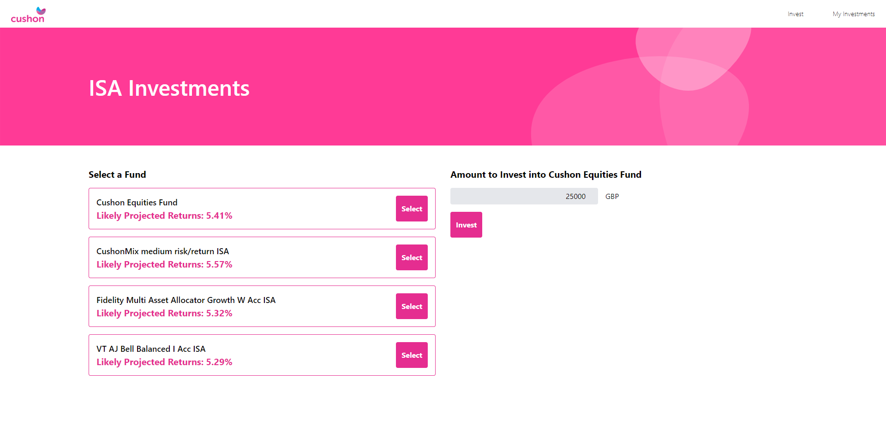

# Cushon Tech Task

https://cushon-tech-task.vercel.app/

## What you have done and why
I created a web app that allows the user to select a fund, enter an amount to invest, and save their investment. They can then view their investments on the "My Investments" page. 

Built with Next.js, TypeScript, Tailwind CSS, and Jest. 

Deployed to Vercel. 

Included unit tests for the utility functions.

I chose these tools because 1) I am familiar with them and 2) they're modern and popular. This allowed me to create this web app quite quickly.

## The specific decisions you made about your solution
I copied the styling of the Cushon website as close as I could whilst still using the predefined classes of Tailwind. 

The investments are stored in local storage for simplicity.

## Any assumptions you have made in the solution you have presented
I assumed the web app would only be used on laptops and desktops. The styling might not look good on tablets and mobile devices.

## Any enhancements you considered but decided not to cover
I considered storing the investments in an AWS DynamoDB database, using the AWS SDK or CLI from a Next.js API handler function. I decided not to cover this to save time.